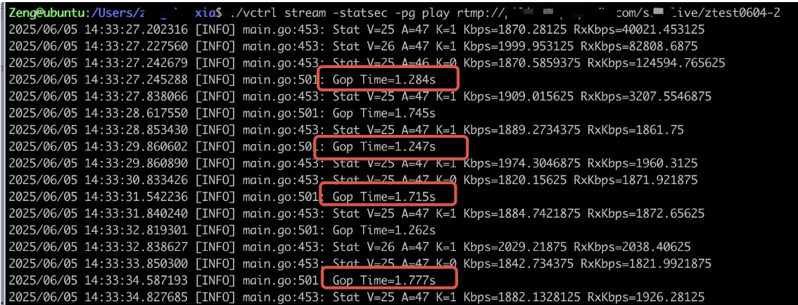
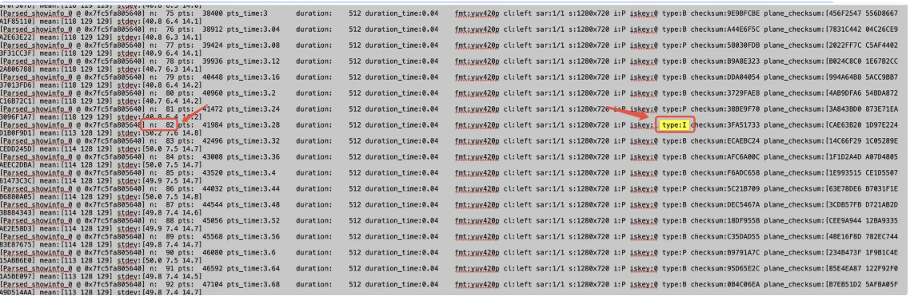
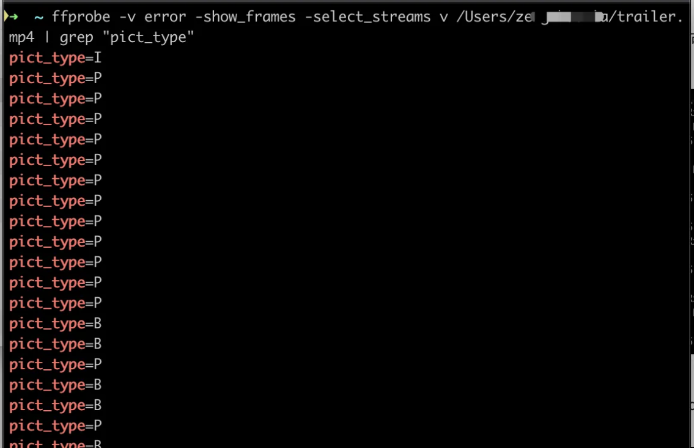
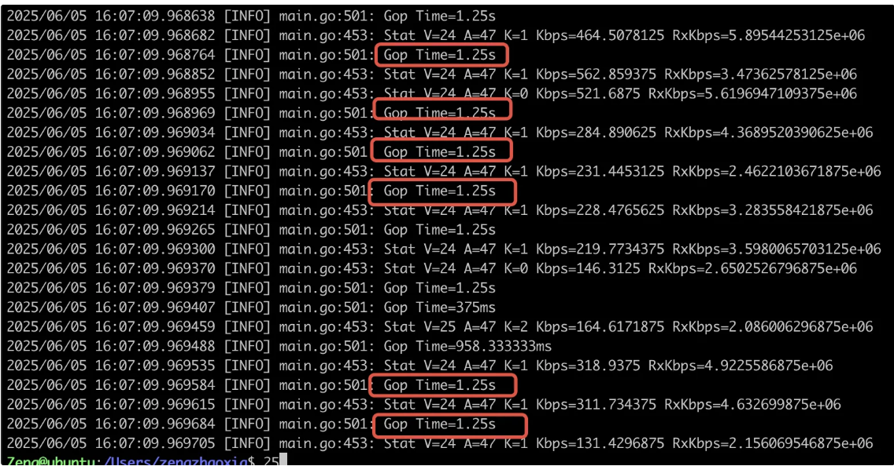

# GOP-关键帧间隔

## 什么是 GOP（sliced_threads=0）

在音视频中 GOP 表示一组连续的视频帧，其中包括 I帧、P帧和B帧，通常被提到的是 GOP 长度，通俗的讲就是 I帧与I帧之间的非I帧数。P帧和B帧要远远小于I帧的，这也是视频压缩能节省空间的一个原因所在。

```go
GOP结构
I B B P B B P P P I
```

播放器接收到I帧时会播放出画面，有时会遇到首开时间较长的问题，这是因为当播放器如果获取到了B帧或P帧时，无法解码，需要进行丢弃，所以会导致首开较长。

## 如何查看视频的 GOP 长度

**方式一：**

使用`vctrl` 工具，可打印出 gop 长度单位是秒, vctrl  工具只能在 Linux 系统中使用，可以查看点播和直播

`./vctrl stream -statsec -pg play 视频` 




**方式二：**

`ffmpeg -i qiniu-2023-720p-fps-1.mp4 -vf "showinfo" -f null - 2>&1 | grep "pts_time:[0-9.]*" > frame_info.txt`

在生成的文件`frame_info.txt` 查看I帧之间的间隔 ，查看对应 I 帧对应的 n 做差值，就是GOP的大小。



```go
n:2  type:I  (第1个I帧)
...
n:82 type:I  (第2个I帧)
```

**GOP 长度 = 82 - 2 = 80 帧，80/25=3.2s ，25表示是视频源帧率**

可以说gop长度为80帧，也可以说3s

## 查看视频中是否存在B帧

方法一：含义同上述过程

`ffmpeg -i qiniu-2023-720p-fps-1.mp4 -vf "showinfo" -f null - 2>&1 | grep "pts_time:[0-9.]*" > frame_info.txt`

方法二：

使用以下命令可累出所有帧类型，可以查看视频中是否存在 B 帧

`ffprobe -v error -show_frames -select_streams v 视频源 | grep "pict_type”`



GOP 越大越好，还是越小越好呢？

GOP越大说明I帧与I帧之间的B帧和P帧比较多，比如上面的GOP长度为 80 帧，说明视频中 **每82帧出现一个关键帧（I帧）**

较长的GOP能够减少关键帧的数量，可以节省存储和带宽，比较合适一些静态场景，视频内容变化较小，比如讲座、监控等。但如果是一些运动场景，如果GOP太大，就会导致依赖P/B帧的预测误差会累积，会增加解码负担，从而导致画质下降和卡顿等问题。

GOP 越小，意味着I帧间隔时间短，可实现秒开功能，但也意味着压缩比例低，同样码率情况下视频的质量会有所下降。

## 推流如何避免有B帧

使用命令

`ffmpeg -re -stream_loop -1 -i trailer.mp4 -c copy -c:v libx264 -bf 0 -f flv rtmp://127.0.0.1/ztest/test-01`

如果要启用B帧，则参数`-bf 2`

针对OBS 如何推不含B帧的直播流可以参考：https://developer.qiniu.com/pili/9886/obs-push-flow-excluding-b-frame-guidelines

## ffmpeg 强制关键帧间隔

有一个视频源GOP大小不均，GOP结构为 2、4、5、10s，现在想强制关键帧间隔，使之平均，例如，使用 ffmpeg 强制每 30 帧一个 I 帧

```go
ffmpeg -i trailer.mp4 -g 30 -c:v libx264 trailer01.mp4
```

**`g 30`**：设置 GOP=30（根据帧率调整，如 30fps 视频 = 1秒一个I帧）。

不同地方场景对gop要求不同

- 直播：**`g 15~30`**
- 流媒体：**`g 30~60`**
- 存档：**`g 100~250`**（仅限静态内容）

在低延迟场景中，通常缩短GOP，增加 I 帧频率。

现在可以通过命令查看强制关键帧间隔之后的文件中的GOP大小

强制关键帧间隔之后的GOP大小为1.25，因为原视频的帧率为24fps，强制gop为30，则30/24 = 1.25s



**可以通过以下命令检查原始编码参数**

```go
➜  ~ ffprobe -v error -show_entries stream=codec_name,r_frame_rate -of csv trailer.mp4
stream,h264,24/1
stream,aac,0/0
```

