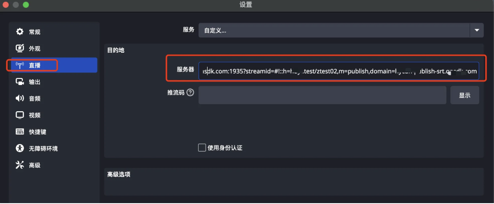
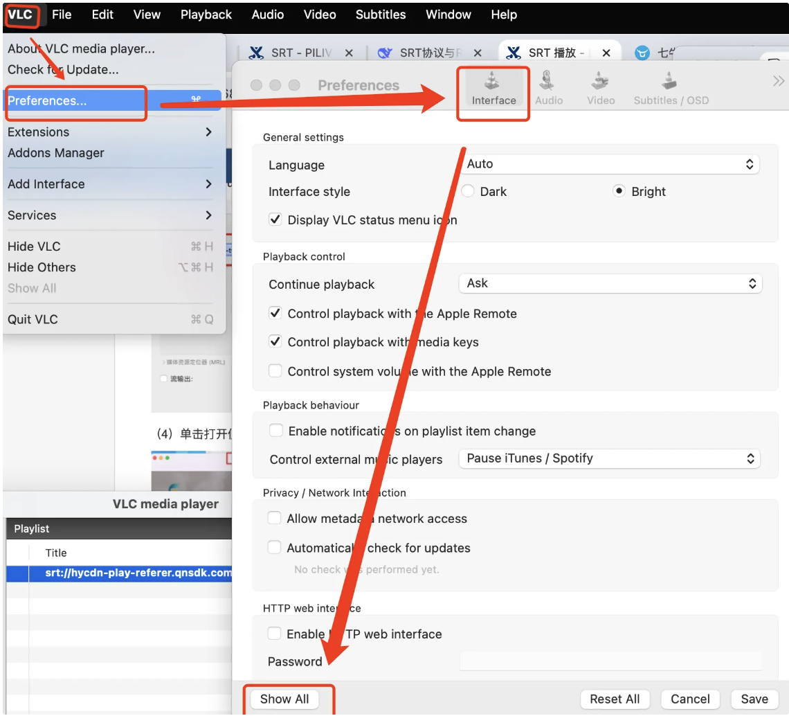
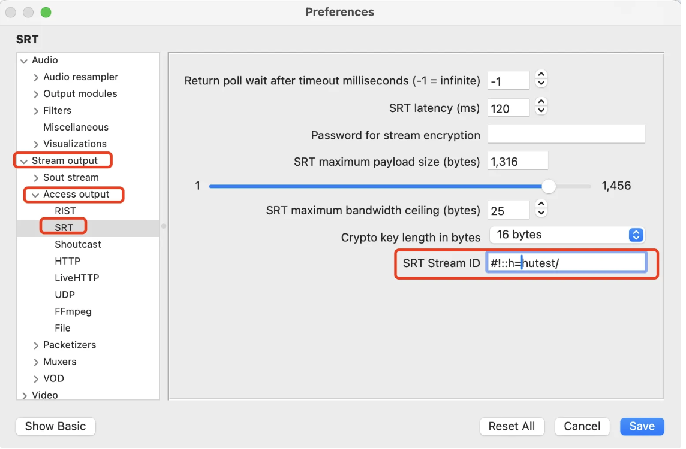
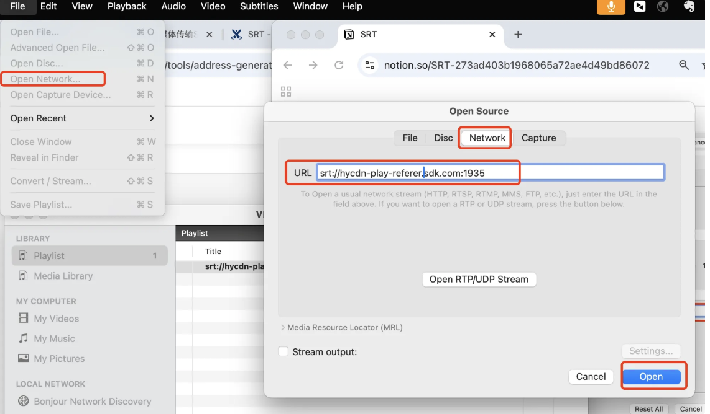

# SRT 概述
SRT是（Secure Reliable Transport）（安全可靠传输）的简称，一个开源的视频传输协议和技术栈，它的两个核心特点是**可靠性**和**安全性。专门为了在不可靠的公共互联网上安全、稳定、高质量地传输低延迟的视频流而设计。**SRT 建立在 UDP 协议之上，这意味着它具备了 UDP 的速度和效率。在弱网情况下推荐使用 SRT 协议推流

# 常见的 SRT 协议URL 格式（非标准）

每个公司可能定义的规则及端口不一样，所以本次示例不代表所有，可参考[七牛srt 推流地址](https://developer.qiniu.com/pili/8170/srt-push-flow-address)

```bash
srt://<RTMPPublishDomain>:1935?streamid=#!::h=<Hub>/<streamTitle>,m=publish,domain=<RTMPPublishDomain>
```

解析：

- `srt://` : 这明确指示客户端 (OBS) 使用SRT 协议去发起连接
- `<RTMPPublishDomain>:1935` 告诉客户端，连接到哪个服务器的哪个端口
- `?streamid=#!::h=<Hub>/<streamTitle>` ：重要参数，用于在握手时传递元数据， 它通常用于模拟 RTMP 中的 “App名称(hub)”和“流名称”

### 运行流程

当推流软件（OBS等）看到 `srt://` 开头，就会准备使用SRT协议。它向服务器 `miku-live-rtmp.teweichaowan.com` 的 **1935 端口**发起一个 **SRT 握手连接**。服务器上的SRT服务正监听着这个端口，于是接受连接并进行通信。**这个端口内部运行的其实是SRT服务，而不是RTMP服务。**

# SRT 推流工具

如 OBS、VLC、ffmpeg、、Gstreamer都已支持SRT协议

## OBS 推 SRT

直接输入推流地址



## FFMPEG 推流

ffmpeg -re -stream_loop -1 -i /Users/Downloads/bbb_30fps_gop_60_3mbps.mp4 -vcodec copy -acodec copy -f mpegts 'srt://publish-srt.sdk.com:1935?streamid=#!::h=test/ztest02,m=publish,[domain=](http://domain=hycdn-publish-srt.qnsdk.com/)publish-srt.sdk.com'

- **`-f mpegts`**: **至关重要！** SRT 协议通常传输的是 **MPEG-TS** 容器格式的流。这个选项告诉FFmpeg 将音视频流打包成 MPEG-TS 格式后再通过 SRT 发送。
- `-re` 是按视频播放帧率推流


# SRT 播放

## ffplay 播放

ffplay -i 'srt://play-referer.sdk.com:1935?streamid=#!::h=hutest/ztest,m=request,[domain=play-referer.sdk.com](http://domain=hycdn-play-referer.qnsdk.com/)'

## VCL 播放

VLC播放SRT需要单独设置streamid，不能在输入URL的地方携带streamid

（1）Preferences——interface——show all——stream output——Access output —— SRT

输入streamd后面的内容，例如 `#!::h=hutest/ztest,m=request,[domain=play-referer.sdk.com](http://domain=hycdn-play-referer.qnsdk.com/)`





（2）输入URL 播放



